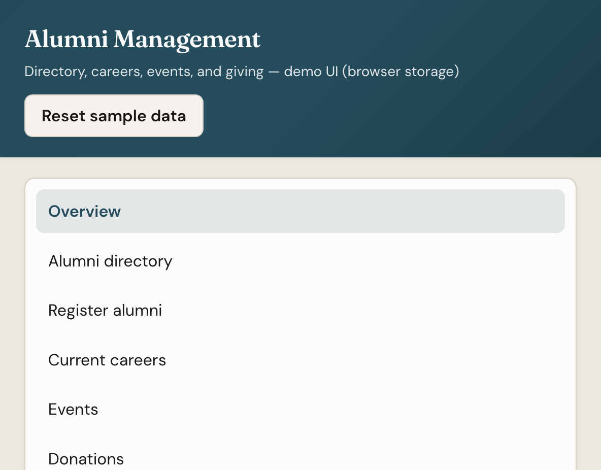
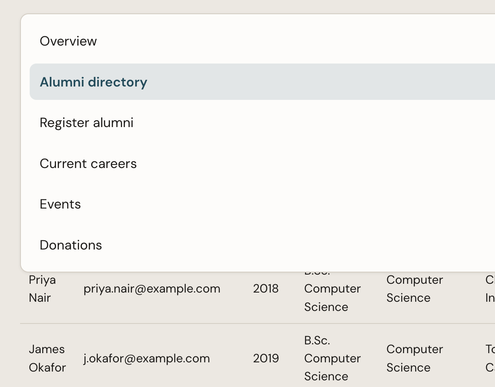
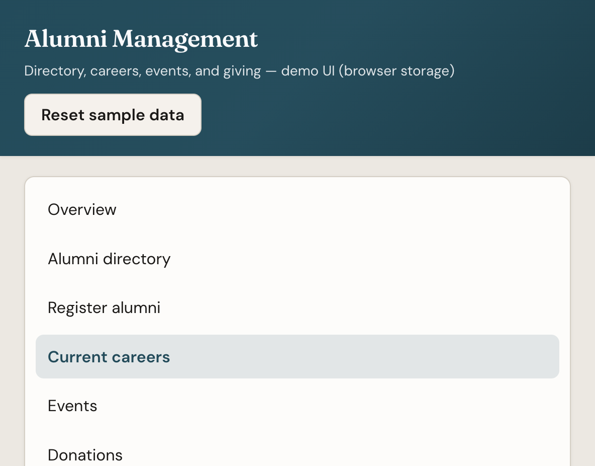
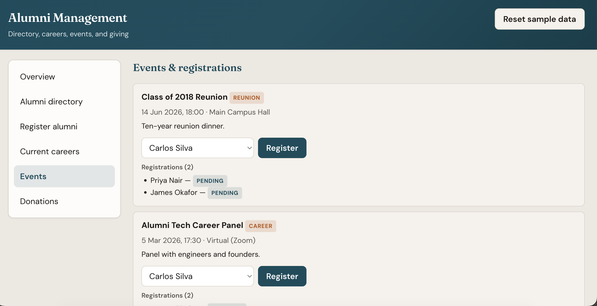
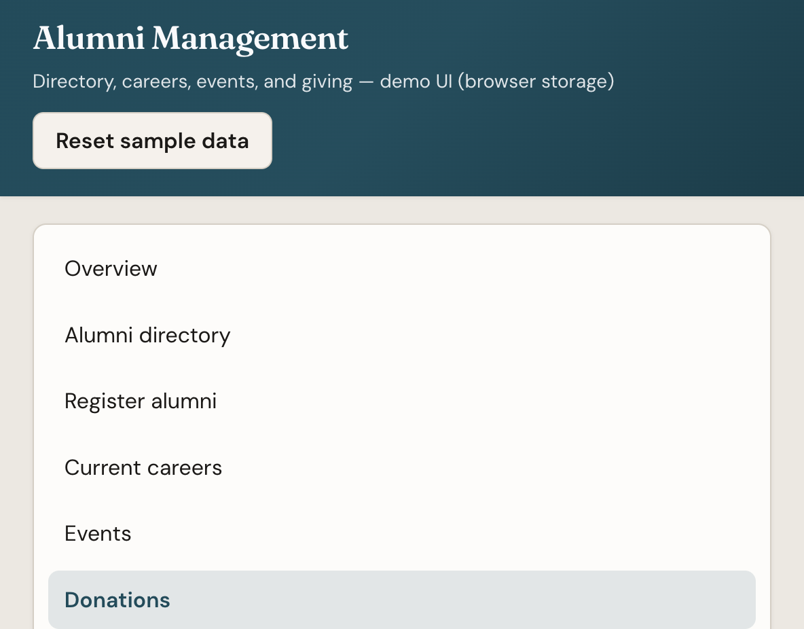
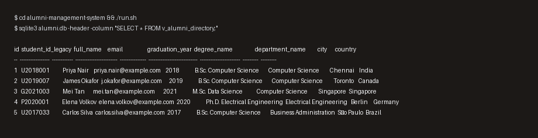
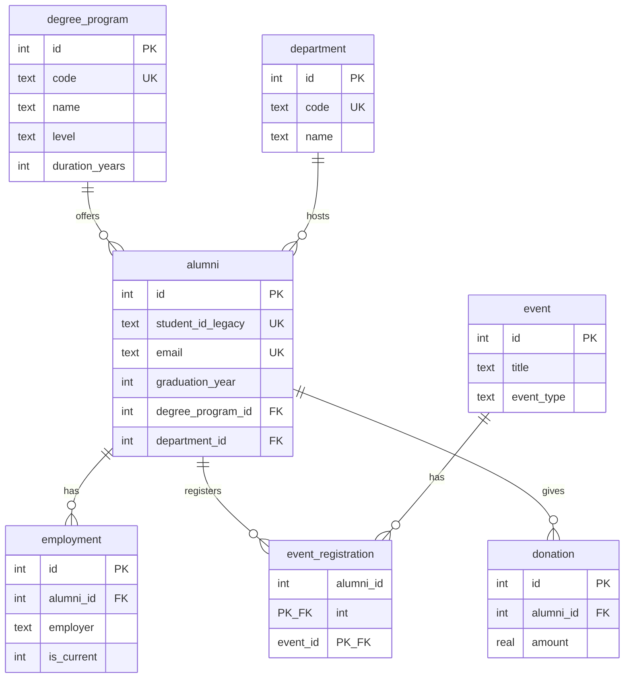

# Alumni management system (DBMS + web UI)

Relational database design for tracking **alumni**, **degrees**, **departments**, **employment**, **events**, and **donations**. The project ships as portable **SQL** you can run with **SQLite** locally or adapt to PostgreSQL / MySQL for coursework, plus a **browser-based front end** (HTML, CSS, JavaScript).


**What is submitted**

- **Database layer:** ER-style relational schema in `sql/01_schema.sql` (constraints, indexes, views), sample data in `sql/02_seed.sql`, and reporting queries in `sql/03_queries.sql`.
- **Runnable DBMS artifact:** SQLite database built by `./run.sh` → `alumni.db` (gitignored; recreate locally).
- **Application UI:** Static web app in `web/` (directory, registration form, careers, events, donations) with in-browser persistence for demos.
- **Evidence:** Screenshots below show the web UI and sample SQL query output.

**How  can verify**

1. Database: from the project root, run `./run.sh`, then `sqlite3 alumni.db` and execute `SELECT * FROM v_alumni_directory;` or `.read sql/03_queries.sql`.
2. Web UI: `cd web && python3 -m http.server 8080` and open the URL shown in the terminal (or open `web/index.html` directly).


## Screenshots (web application)

**Overview**



**Alumni directory**



**Register alumni**


**Current employment**



**Events and registrations**



**Donations**



## Screenshot (database sample output)

Query: `SELECT * FROM v_alumni_directory;` on the seeded SQLite database (after `./run.sh`).



## Entity–relationship overview



## Design notes

- **Primary and foreign keys** enforce referential integrity; `employment` and `event_registration` use `ON DELETE CASCADE` where child rows should disappear with the alumni record; `donation` uses `ON DELETE RESTRICT` so financial rows are not dropped accidentally.
- **CHECK** constraints validate degree level, event type, graduation year range, and consistent “current job” flags (`is_current = 1` implies `end_date IS NULL`).
- **Indexes** support common filters: graduation year, department, degree, name, and employment lookups.
- **Views** `v_alumni_directory` and `v_current_employment` simplify reporting queries.

## Quick start (SQLite)

Requires [SQLite](https://www.sqlite.org/) (`sqlite3` CLI).

```bash
cd alumni-management-system
chmod +x run.sh
./run.sh
```

This creates `alumni.db`. Interactive session:

```bash
sqlite3 alumni.db
```

Example:

```sql
.tables
SELECT * FROM v_alumni_directory;
.read sql/03_queries.sql
```

## Web UI (HTML / CSS / JavaScript)

A small **single-page** interface lives in `web/`. It mirrors the same entities as the SQL schema: directory, profiles, current jobs, event registration, and donations. Data is kept in **`localStorage`** in the browser (no backend required). **`Reset sample data`** reloads the JSON seed.

Open the app in either of these ways:

1. **Direct file** — open `web/index.html` in a browser (data loads from embedded seed if `fetch` to `data/seed.json` is blocked).
2. **Local server** (recommended so `data/seed.json` loads over HTTP):

```bash
cd alumni-management-system/web
python3 -m http.server 8080
```

Then visit [http://127.0.0.1:8080](http://127.0.0.1:8080).

| Path | Purpose |
|------|---------|
| `web/index.html` | Page structure and sections |
| `web/styles.css` | Layout, typography, tables, forms |
| `web/app.js` | State, rendering, forms, persistence |
| `web/data/seed.json` | Same sample data as `sql/02_seed.sql` (JSON) |

## File layout

| Path | Purpose |
|------|---------|
| `sql/01_schema.sql` | DDL: tables, constraints, indexes, views |
| `sql/02_seed.sql` | Sample rows for demos and assignments |
| `sql/03_queries.sql` | Example GROUP BY / JOIN / reporting queries |
| `run.sh` | Recreate `alumni.db` from schema + seed |
| `web/*` | Browser UI (see above) |
| `docs/images/*` | Screenshots for documentation / submission |
| `scripts/generate_readme_images.py` | Renders SQLite sample output as `docs/images/db-01-v_alumni_directory.png` |

## Porting to another DBMS

- Replace `AUTOINCREMENT` with `SERIAL` / `IDENTITY` as needed.
- Keep `PRAGMA foreign_keys` only for SQLite; enable foreign keys in your server’s session settings.
- Adjust `datetime('now')` / `date('now')` to `CURRENT_TIMESTAMP` / `CURRENT_DATE` if your engine prefers them.

## Git

When you are ready:

```bash
git init
git add .
git commit -m "Initial commit: alumni management system schema and seed data"
```

`.gitignore` excludes local `*.db` files.
